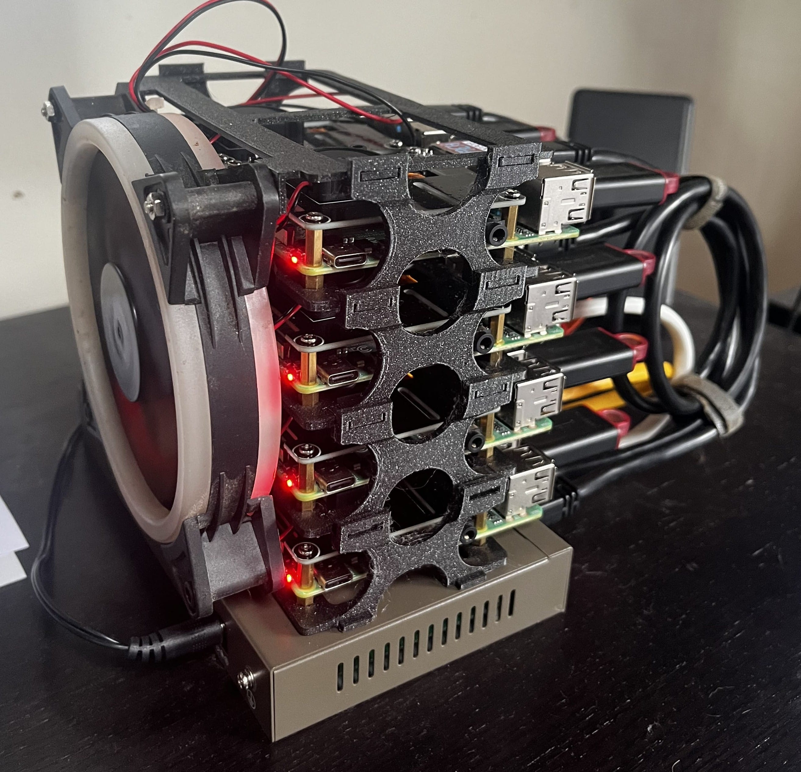

# Raspberry pi cluster

This is my little project to train for CKA on a raspberry pi cluster.
My own cluster has 8 nodes (3 controllers / 5 workers) and is powered trough PoE.
It is complemented by a 256GB USB3 stick per raspberry to have some persistent storage.



## Bill of materials

| Item | Quantity | Unit price | Total |
| - | - | - | - |
| [Raspberry Pi 4 4Gb](https://www.amazon.com.be/-/en/4595-Raspberry-Pi-Model-4GB/dp/B09TTNF8BT) | 8 | 79.38 € | 635.04 € |
| [Rasbperry Pi PoE Hat](https://www.amazon.com.be/-/en/Power-Ethernet-Raspberry-802-3af-Compliant-Official/dp/B096YXVMWS) | 8 | 22.42 € | 179.36 € |
| [MicroSD Card 64GB](https://www.amazon.com.be/-/en/SanDisk-SDSQUA4-064G-GN6MA-microSDXC-Adapter-Approved/dp/B08GYBBBBH) | 8 | 8.33 € | 66.64 € |
| [USB3 sticks 256GB](https://www.amazon.com.be/dp/B08JD3DSTJ?psc=1&ref=ppx_yo2ov_dt_b_product_details) | 8 | 17.99 € | 143.92 € |
| [UTP cable 25cm](https://www.amazon.com.be/-/en/Cat6-Ethernet-Cable-Gigabit-Netwerkkabel/dp/B00O2EH7JM)* | 10 | 1.43 € | 14.30 € |
| [120mm fan](https://www.amazon.com.be/-/en/BURAN-12025-12V-Pin-Cooling/dp/B08F2LMVTW) | 1 | 2.88 € | 2.88 € |
| [9 port PoE Gbps switch](https://www.amazon.com.be/dp/B09CPY51MB) | 1 | 80.65 € | 80.65 € |
| **Total** ||| **1122.79 €** |

```* sold per 10```

## Modular Rack

I designed a parametric 3D model for the modular racking.
One layer holds two Raspberry Pis and allows to stack as much layer as you want.
The models

* [rack unit](./3d-models/2rpiholder-modular-rack-v3.stl)
* [top plate and fan holder](./3d-models/2rpiholder-modular-rack-top-fan-v1.stl)
